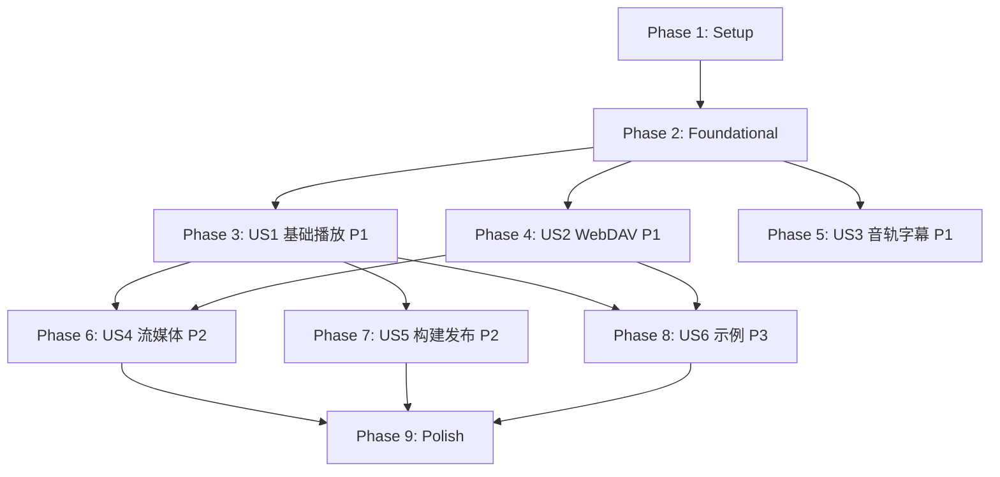

# Tasks: VidAll_Player HarmonyOS/OpenHarmony TV libmpv 组件库

**Input**: Design documents from `/specs/001-harmonyos-mpv-sdk/`

**Prerequisites**: plan.md ✅, spec.md ✅, research.md ✅, data-model.md ✅, contracts/ ✅, quickstart.md ✅

**Tests**: 本规格未显式要求 TDD；测试任务仅覆盖契约、冒烟与门禁验证。

**Organization**: 任务按用户故事组织，每个故事可独立实施与验证。

## Format: `[ID] [P?] [Story] Description`

- **[P]**: 可并行（不同文件、无未完成依赖）
- **[Story]**: 所属用户故事（US1–US6）
- 描述包含确切文件路径

---

## Phase 1: Setup（项目初始化）

**Purpose**: 创建库边界、项目结构与基础配置

- [x] T001 创建 `packages/vidall-player/` HAR 包目录结构，包括 `Index.ets`、`src/public/`、`src/xcomponent/`、`src/internal/`、`src/native/`、`oh-package.json5`、`build-profile.json5`
- [x] T002 [P] 创建 `native/bridge/`、`native/session/`、`native/render/`、`native/media/`、`native/include/`、`native/tests/`、`native/config/`、`native/patches/` 目录并添加占位文件
- [x] T003 [P] 创建 `examples/tv-phone-demo/` 与 `examples/consumer-smoke/` 示例项目骨架
- [x] T004 [P] 创建 `scripts/build/`、`scripts/audit/`、`scripts/evidence/`、`scripts/release/` 脚本目录并添加占位文件
- [x] T005 [P] 创建 `release/` 生成证明目录结构（manifests/、sbom/、licenses/、capabilities/、audits/），添加 .gitkeep
- [x] T006 配置 `packages/vidall-player/oh-package.json5` 包元数据，包名暂定 `@vidall/player`
- [x] T007 [P] 配置 `packages/vidall-player/build-profile.json5` HAR 构建目标
- [x] T008 配置根 `build-profile.json5` 增加库模块与示例模块
- [x] T009 [P] 建立 API 15/19/22 审查表模板在 `native/config/api-review-template.json`
- [x] T010 [P] 配置 `.gitignore` 排除 `release/` 生成产物、`.cache/` 和构建输出

---

## Phase 2: Foundational（阻塞性前置条件）

**Purpose**: 所有用户故事依赖的核心基础设施——必须完成后才能开始任何用户故事

**⚠️ CRITICAL**: 本阶段未完成前，不可开始任何用户故事

- [x] T011 在 `packages/vidall-player/src/public/` 实现核心类型定义：`PlayerState`、`PlayerSurface`、`PlayerOptions`、`MediaSource`、`ExternalSubtitle`、`PlayerTrack`、`PlayerError`、`PlayerEvent`，严格匹配 `contracts/arkts-sdk.md`
- [x] T012 在 `packages/vidall-player/src/public/` 实现 `VidAllPlayer` 接口与 `createPlayer` 工厂函数声明
- [x] T013 在 `packages/vidall-player/Index.ets` 实现唯一公开导出，只导出契约定义的类型和 `createPlayer`
- [x] T014 [P] 在 `packages/vidall-player/src/internal/` 实现输入校验器：URI/头部/重定向信任范围校验、禁止 URL 用户信息、认证头运行时安全
- [x] T015 [P] 在 `packages/vidall-player/src/internal/` 实现错误脱敏器：过滤密码、Authorization、令牌、完整路径和敏感查询参数
- [x] T016 [P] 在 `packages/vidall-player/src/internal/` 实现命令串行化队列：每会话串行处理、拒绝已释放会话命令、前置条件检查
- [x] T017 在 `packages/vidall-player/src/native/` 建立 NAPI 类型声明文件，声明 native 层暴露的函数签名，不导出给消费者
- [x] T018 [P] 在 `packages/vidall-player/src/xcomponent/` 实现 XComponent 生命周期适配：`attachSurface`、`resizeSurface`、`detachSurface`，只传递 `componentId`+`generation`，不暴露 NativeWindow
- [x] T019 在 `packages/vidall-player/src/internal/` 实现会话状态机：八态迁移、事件序号严格递增、releasePhase (open/closing/closed)
- [x] T020 [P] 在 `packages/vidall-player/src/internal/` 实现 API 15/19/22 运行时特性探测与降级封装

**Checkpoint**: 基础就绪——用户故事实现可并行开始

---

## Phase 3: User Story 1 — 在电视上稳定播放已选媒体（Priority: P1）🎯 MVP

**Goal**: 在 ARM64 目标电视上完成创建播放器、附着画面、加载本地/HTTP 视频、播放控制与安全释放

**Independent Test**: 对本地 MP4 和普通 HTTP 视频完成创建→附着→加载→首帧→播放→跳转→暂停→恢复→释放，且重复释放不崩溃

### Implementation for User Story 1

- [ ] T021 [US1] 在 `native/session/` 实现每会话独立 `mpv_handle` 管理：创建、命令队列、订阅表、渲染实例，禁止全局播放器和全局 EGL context
- [ ] T022 [US1] 在 `native/session/` 实现 MPV 事件循环线程：调用 `mpv_wait_event` 驱动 render callback 和事件处理
- [ ] T023 [US1] 在 `native/render/` 实现 NativeWindow/EGL/GLES 渲染管理：EGLDisplay/Context/Surface 生命周期、surface generation 防止销毁后使用
- [ ] T024 [US1] 在 `native/render/` 实现 SW render 回退路径：内存帧缓冲 + PixelMap 回调（用于模拟器或 GPU 不可用场景）
- [ ] T025 [US1] 在 `native/bridge/` 实现 NAPI 导出层：`create`、`attachSurface`、`resizeSurface`、`detachSurface`、`load`、`play`、`pause`、`seekRelative`、`seekPercent`、`setSpeed`、`setVolume`、`setMuted`、`stop`、`release`
- [ ] T026 [US1] 在 `native/bridge/` 实现线程安全事件投递：libmpv 事件→原生队列→按会话序号→ArkTS，释放时撤销投递并使旧任务失效
- [ ] T027 [US1] 在 `native/media/` 实现本地文件和 HTTP/HTTPS 媒体加载：受控头部、TLS/SNI/证书链验证、重定向信任范围、Range 请求
- [ ] T028 [US1] 在 `native/media/` 实现硬解状态探测与回退：运行时输出 hwdec 状态、实际选定解码器和软硬回退原因
- [ ] T029 [US1] 在 `native/session/` 实现释放顺序：拒绝新命令→停止媒体/回调→解绑渲染→销毁 EGL surface/context/display→终止 mpv→清除 NAPI 引用和队列
- [ ] T030 [US1] 在 `native/media/` 实现错误映射：libmpv/FFmpeg 错误→结构化 PlayerError（域、稳定码、中文信息、可重试、脱敏上下文）
- [ ] T031 [US1] 在 `packages/vidall-player/src/public/` 实现 `VidAllPlayer` 完整类：组合 NAPI 调用、命令队列、状态机、事件分发和错误处理
- [ ] T032 [US1] 在 `packages/vidall-player/src/public/` 实现播放控制命令：`load`、`play`、`pause`、`seekRelative`、`seekPercent`、`setSpeed`、`setVolume`、`setMuted`、`stop`
- [ ] T033 [US1] 在 `packages/vidall-player/src/public/` 实现释放与幂等：`release` 首次封闭入口并按序回收，后续调用无操作
- [ ] T034 [US1] 迁移现有 `entry/src/main/cpp/napi_bridge.cpp` 的播放器逻辑到 `native/` 分层结构中
- [ ] T035 [US1] 迁移现有 `entry/src/main/ets/pages/Index.ets` 的 PixelMap 回调渲染到 `packages/vidall-player/src/xcomponent/`
- [ ] T036 [US1] 验证本地 MP4 (H.264+AAC) 在模拟器上通过 PixelMap 路径可播放、可见画面
- [ ] T037 [US1] 验证重复 `release`、无效 URI、surface 先销毁后命令调用不崩溃、不泄漏

**Checkpoint**: 用户故事 1 完成后，本地/HTTP 基础播放可在目标设备上独立验证

---

## Phase 4: User Story 2 — 通过 WebDAV 选择并播放私有媒体（Priority: P1）

**Goal**: 用户可配置 WebDAV 服务、浏览目录、选择视频并播放；认证、重定向和断网恢复安全可靠

**Independent Test**: 使用受控测试 WebDAV 服务验证目录选择、Basic Authorization、HTTPS 证书链、重定向、Range 跳转和连接失败后的可恢复错误

### Implementation for User Story 2

- [ ] T038 [US2] 在 `native/media/` 实现 WebDAV Basic Authorization：通过 MPV `http-header-fields` 传递，禁止 URL 用户信息传凭据
- [ ] T039 [US2] 在 `native/media/` 实现 301/302/307/308 重定向处理：认证信息在允许的同一受信任服务范围内保持有效
- [ ] T040 [US2] 在 `native/media/` 实现 Range 请求与分段读取：WebDAV Range 跳转、连接复用时 Header 不丢失
- [ ] T041 [US2] 在 `packages/vidall-player/src/public/` 实现 `MediaSource` 的 `headers` 字段安全传递到 native 层
- [ ] T042 [US2] 在 `packages/vidall-player/src/internal/` 实现 WebDAV 服务配置管理：显示名、服务端地址、认证状态、安全存储引用，不保存/返回明文密码
- [ ] T043 [US2] 在 `packages/vidall-player/src/internal/` 实现日志脱敏增强：WebDAV 场景下 Authorization、密码、凭据不进入日志/事件/错误
- [ ] T044 [US2] 验证受控 WebDAV 服务的目录浏览、Basic Auth、HTTPS 证书、重定向和断网恢复

**Checkpoint**: 用户故事 2 完成后，WebDAV 媒体来源可独立验证

---

## Phase 5: User Story 3 — 选择音轨和字幕（Priority: P1）

**Goal**: 用户可枚举音轨/字幕、切换音轨、添加外挂字幕，并在中文/双向文字/字体缺失时获得可预测结果

**Independent Test**: 对含多音轨与内嵌字幕的视频、网络字幕 URL、SRT/ASS 文件执行轨道枚举、连续切换、跳转后稳定性、字幕延迟和编码降级

### Implementation for User Story 3

- [ ] T045 [US3] 在 `native/media/` 实现轨道枚举：`track-list` 解析→`PlayerTrack[]`（id、类型、语言、标题、选择状态、识别/渲染结论）
- [ ] T046 [US3] 在 `native/media/` 实现音轨切换：`aid` 设置、连续切换、音画同步、跳转后稳定性
- [ ] T047 [US3] 在 `native/media/` 实现字幕轨道切换：`sid` 设置、`sub-add` 外挂字幕、字幕延迟调整
- [ ] T048 [US3] 在 `native/media/` 实现外挂字幕加载：SRT、ASS/SSA、WebVTT 本地文件与网络 URL
- [ ] T049 [US3] 在 `native/media/` 配置 libass 字体栈：FriBidi、FreeType、HarfBuzz、Fontconfig，确保 CJK 字体发现与兜底
- [ ] T050 [US3] 在 `packages/vidall-player/src/public/` 实现 `selectTrack`、`addExternalSubtitle`、`setSubtitleDelay` 命令
- [ ] T051 [US3] 在 `packages/vidall-player/src/internal/` 实现字幕渲染互斥：首版只启用 libass 原生渲染，禁止与 ArkTS 字幕覆盖层重复渲染
- [ ] T052 [US3] 验证多音轨枚举/切换、内嵌 ASS/SRT 字幕、外挂字幕、字幕延迟、字体缺失降级

**Checkpoint**: 用户故事 3 完成后，音轨/字幕交互可独立验证

---

## Phase 6: User Story 4 — 播放流媒体和 SMB 代理媒体（Priority: P2）

**Goal**: 用户可播放 HTTPS 直链、HLS、DASH，以及由业务层转成 localhost HTTP 的 SMB 媒体

**Independent Test**: 分别使用 HTTPS、HLS 主/媒体播放列表、DASH 清单以及 SMB localhost HTTP 代理样本验证加载、分段、跳转、授权、网络中断和代理清理

### Implementation for User Story 4

- [x] T053 [US4] 在 `native/media/` 实现 HLS 支持：master/media playlist、fMP4/TS 分段、缓存和跳转
- [x] T054 [US4] 在 `native/media/` 实现 DASH 支持：MPD 清单解析、自适应流选择、缓存和跳转
- [x] T055 [US4] 在 `native/media/` 实现 SMB localhost HTTP 代理策略：`localhostProxy` 媒体类型、proxyLeaseId 关联与清理
- [x] T056 [US4] 在 `packages/vidall-player/src/public/` 实现 `MediaSource.kind` 的 `hls`、`dash`、`localhostProxy` 类型处理
- [x] T057 [US4] 在 `packages/vidall-player/src/internal/` 实现网络中断恢复：旧连接/旧媒体状态清理、重试或显示不可恢复原因
- [x] T058 [US4] 在 `native/media/` 实现外挂音频/字幕网络 URL 支持：`audio-files`、`sub-files` 远程文件与本地缓存
- [ ] T059 [US4] 验证 HTTPS 直链、HLS、DASH、SMB localhost HTTP 代理的加载/跳转/认证/断网恢复
- [ ] T060 [US4] 验证外挂字幕网络 URL 和本地缓存文件的加载与错误处理

**Checkpoint**: 用户故事 4 完成后，流媒体与 SMB 代理可独立验证

---

## Phase 7: User Story 5 — 安装并发布可信组件（Priority: P2）

**Goal**: 集成者可从受控私有制品源安装版本化组件；发布负责人可向双渠道发布经审计的同一版本

**Independent Test**: macOS/Linux 干净环境构建；从批准私有制品源安装到隔离消费方样例；校验下载内容、元数据、哈希、ABI、导出符号和发布一致性

### Implementation for User Story 5

- [ ] T061 [US5] 在 `native/config/` 建立完整 `sources.lock.json`：覆盖 libmpv、FFmpeg 及所有传递依赖、子模块、补丁、归档 SHA-256、许可证、工具链摘要和构建开关
- [ ] T062 [US5] 在 `scripts/build/` 实现受控下载、校验、补丁应用和离线构建脚本 `reproducible-build.sh`，替换 `native/scripts/build-libmpv-bootstrap.sh`
- [ ] T063 [US5] 在 `scripts/build/` 实现 macOS 与 Linux clean build 验证，记录输入和差异解释
- [ ] T064 [US5] [P] 在 `scripts/audit/` 实现 ELF 审计脚本 `verify-release.sh`：确认 `aarch64-linux-ohos` 架构、ABI、SONAME/NEEDED 白名单、导出符号白名单和禁止符号
- [ ] T065 [US5] [P] 在 `scripts/audit/` 实现敏感信息扫描：检查发布物中的密码、Authorization、令牌和完整用户路径
- [ ] T066 [US5] 在 `scripts/release/` 实现 `release-manifest.json` 生成，匹配 `contracts/release-manifest.md` schema
- [ ] T067 [US5] 在 `scripts/release/` 实现 SBOM 生成（CycloneDX 或 SPDX）、LICENSE/NOTICE 汇集、许可证结论
- [ ] T068 [US5] [P] 在 `scripts/release/` 实现能力清单 `capabilities.json` 生成：构建配置、可用 demuxer/protocol/decoder/encoder/filter、动态依赖、ABI、minSdk、构建时间和源 commit
- [ ] T069 [US5] 替换 `.github/workflows/build-libmpv.yml` 为三条受控工作流：`verify.yml`（PR 验证）、`candidate.yml`（tag 候选制品）、`publish.yml`（批准后双渠道发布）
- [ ] T070 [US5] 在 `scripts/release/` 实现 GitHub Release 上传与批准私有 ohpm 源上传脚本
- [ ] T071 [US5] 在 `scripts/release/` 实现双渠道回读验证：比较版本、来源提交、HAR SHA-256、SBOM SHA-256 与发布说明摘要，完全一致才为 `published`
- [ ] T072 [US5] 在 `examples/consumer-smoke/` 实现隔离消费者：仅从批准私有 ohpm 源安装候选 HAR，验证创建→附着→加载→播放→释放，不访问 `native/`
- [ ] T073 [US5] 在 `scripts/evidence/` 实现 IJK 兼容矩阵模板 `ijk-compatibility-matrix.json`，匹配 `contracts/compatibility-matrix.md` 字段
- [ ] T074 [US5] 验证 macOS/Linux clean build 产出相同源版本与 ABI 产物
- [ ] T075 [US5] 验证隔离消费者冒烟流程与 ELF 审计通过

**Checkpoint**: 用户故事 5 完成后，受控构建、供应链与发布流程可独立验证

---

## Phase 8: User Story 6 — 在手机或电视示例中验证生命周期（Priority: P3）

**Goal**: 集成开发者可运行最小示例，在手机/电视上验证焦点可达性、画面重建、连续切源、后台恢复和资源释放

**Independent Test**: 在至少一个目标电视和一个可安装手机设备上执行遥控器/触控可达性、画面重建、连续切源、后台恢复、网络断开与重复释放验收

### Implementation for User Story 6

- [ ] T076 [US6] 在 `examples/tv-phone-demo/` 实现 WebDAV 安全配置界面：服务端地址输入、认证状态显示、目录浏览和视频选择
- [ ] T077 [US6] 在 `examples/tv-phone-demo/` 实现播放界面：XComponent 画面、播放控制（暂停/恢复/跳转/音量/静音）、状态与错误展示
- [ ] T078 [US6] 在 `examples/tv-phone-demo/` 实现 TV 遥控器焦点管理：方向键/确认键/返回键、焦点顺序、焦点陷阱检查、列表边界
- [ ] T079 [US6] 在 `examples/tv-phone-demo/` 实现画面重建场景：Surface 销毁与重建、旧 surface generation 丢弃
- [ ] T080 [US6] 在 `examples/tv-phone-demo/` 实现连续切源场景：加载新媒体前停止/释放旧资源、避免音频重叠
- [ ] T081 [US6] 在 `examples/tv-phone-demo/` 实现后台恢复场景：Ability 状态变化、前后台切换后的播放恢复或错误展示
- [ ] T082 [US6] 在 `examples/tv-phone-demo/` 实现网络断开恢复场景：断网检测、重试入口、不可恢复错误展示
- [ ] T083 [US6] 在 `examples/tv-phone-demo/` 实现资源释放与重复释放场景：退出时释放、错误时释放、重复释放不崩溃
- [ ] T084 [US6] 验证 TV 遥控器焦点/确认/返回/边界 100% 手工验收通过
- [ ] T085 [US6] 验证画面重建、连续切源、后台恢复、网络断开恢复和资源释放手工验收通过

**Checkpoint**: 用户故事 6 完成后，示例生命周期场景可独立验证

---

## Phase 9: Polish & Cross-Cutting Concerns

**Purpose**: 跨用户故事的改进与收尾

- [ ] T086 [P] 在 `native/media/` 实现视频参数事件：比例、旋转、像素宽高比、裁剪、deinterlace
- [ ] T087 [P] 在 `native/media/` 实现 SDR 基线色彩正确性验证
- [ ] T088 [P] 在 `native/media/` 实现 PGS/VobSub 字幕轨道识别（渲染验证记为"已构建待验证"）
- [ ] T089 [P] 在 `native/media/` 记录 AC-3/E-AC-3/DTS/DTS-HD/TrueHD/MLP/Audio Vivid 音频解码真机结论
- [ ] T090 [P] 在 `native/media/` 记录 1080p/4K/10-bit/60fps 性能边界真机结论
- [ ] T091 [P] 在 `native/media/` 记录 HDR10/HLG/Dolby Vision 色彩真机结论（未实测标"已构建待验证"）
- [ ] T092 在 `native/config/` 建立完整 FFmpeg configure 与 MPV meson options 记录
- [ ] T093 [P] 在 `packages/vidall-player/src/public/` 实现高级选项白名单入口，禁止外部任意覆盖安全/网络/文件访问策略
- [ ] T094 [P] 在 `packages/vidall-player/src/public/` 实现截图能力（是否公开由发布说明明确）
- [ ] T095 在 `scripts/evidence/` 实现 ARM64 真机证据校验：100 次核心生命周期冒烟、遥控器、后台、网络和释放用例
- [ ] T096 [P] 更新 `README.md`：项目概述、构建说明、示例使用、支持矩阵三态声明和已知限制
- [ ] T097 [P] 清理诊断代码：移除 GetPlayerStatus 中的 session 指针地址、帧数等调试信息，移除控制台频繁日志
- [ ] T098 [P] 在 `native/render/` 优化帧轮询：空闲时降低轮询频率，播放时恢复 ~30fps
- [ ] T099 运行 `quickstart.md` 验证：清洁构建、消费者冒烟、ARM64 真机门禁和双渠道发布回读

---

## Dependencies & Execution Order

### Phase Dependencies

- **Setup (Phase 1)**: 无依赖——可立即开始
- **Foundational (Phase 2)**: 依赖 Setup 完成——**阻塞所有用户故事**
- **US1 (Phase 3)**: 依赖 Foundational——无其他故事依赖
- **US2 (Phase 4)**: 依赖 Foundational——可与 US1/US3 并行，但依赖 US1 的 NAPI 基础设施
- **US3 (Phase 5)**: 依赖 Foundational——可与 US1/US2 并行，但依赖 US1 的 NAPI 基础设施
- **US4 (Phase 6)**: 依赖 US1 和 US2（流媒体需要基础播放和认证）
- **US5 (Phase 7)**: 依赖 US1（需要可构建的库产物）；可与 US2/US3 并行
- **US6 (Phase 8)**: 依赖 US1 和 US2（示例需要基础播放和 WebDAV）
- **Polish (Phase 9)**: 依赖所有目标用户故事完成

### User Story Dependencies



### Within Each User Story

- 类型定义先于实现
- Native 层先于 ArkTS 门面
- 核心命令先于高级命令
- 功能实现先于验证

### Parallel Opportunities

- Phase 1: T002, T003, T004, T005, T007, T009, T010 可并行
- Phase 2: T014, T015, T016, T018, T020 可并行
- Phase 5 (US5): T064, T065, T068 可并行
- Phase 7: T086–T094 均可并行（不同文件）
- US1/US2/US3 在 Foundational 完成后可由不同开发者并行推进

---

## Parallel Example: User Story 1

```bash
# Phase 2 并行任务:
Task: "实现输入校验器 in packages/vidall-player/src/internal/"
Task: "实现错误脱敏器 in packages/vidall-player/src/internal/"
Task: "实现命令串行化队列 in packages/vidall-player/src/internal/"
Task: "实现 XComponent 生命周期适配 in packages/vidall-player/src/xcomponent/"
Task: "实现 API 15/19/22 运行时特性探测 in packages/vidall-player/src/internal/"
```

---

## Implementation Strategy

### MVP First (User Story 1 Only)

1. 完成 Phase 1: Setup
2. 完成 Phase 2: Foundational (**CRITICAL** — 阻塞所有故事)
3. 完成 Phase 3: US1 基础播放
4. **STOP and VALIDATE**: 在目标设备独立验证 US1
5. 若就绪可部署/演示

### Incremental Delivery

1. Setup + Foundational → 基础就绪
2. US1 基础播放 → 独立验证 → MVP 交付
3. US2 WebDAV → 独立验证 → 网络来源交付
4. US3 音轨字幕 → 独立验证 → 多语言交付
5. US4 流媒体 → 独立验证 → 协议扩展交付
6. US5 构建发布 → 独立验证 → 供应链交付
7. US6 示例 → 独立验证 → 集成验证交付
8. 每个故事增量交付价值，不破坏已完成故事

### Parallel Team Strategy

多开发者场景：

1. 团队共同完成 Setup + Foundational
2. Foundational 完成后：
   - 开发者 A: US1 基础播放
   - 开发者 B: US2 WebDAV（US1 NAPI 就绪后）
   - 开发者 C: US5 构建发布（US1 产物就绪后）
3. 各故事独立完成与集成

---

## Notes

- [P] 任务 = 不同文件、无未完成依赖
- [Story] 标签将任务映射到具体用户故事以追踪
- 每个用户故事应可独立完成与验证
- 每个任务或逻辑分组后提交
- 在任何 checkpoint 停下来独立验证故事
- 避免：模糊任务、同文件冲突、破坏独立性的跨故事依赖
- 所有能力结论必须使用三态："已通过真机样本"/"已构建待验证"/"不支持或暂缓"
- 不修改、构建、提交或发布 VidAll_TV