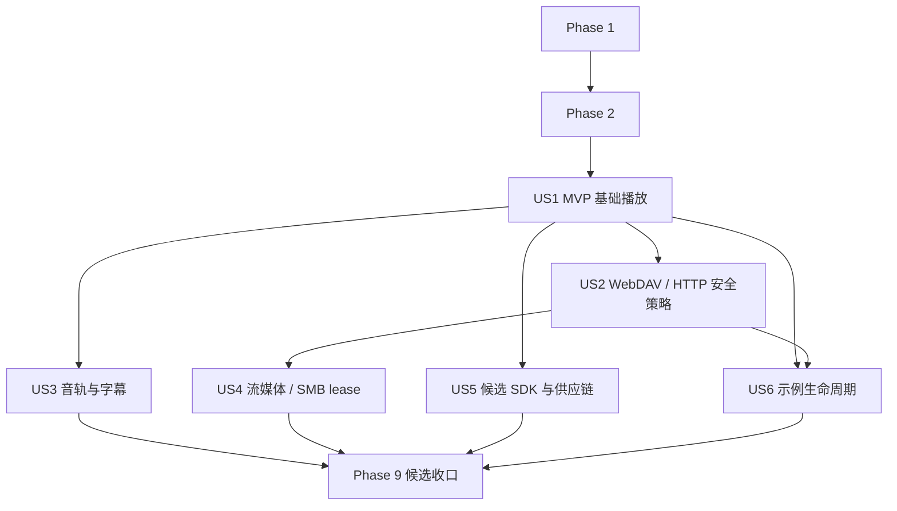

# Tasks: VidAll_Player HarmonyOS/OpenHarmony TV libmpv 组件库

**Input**: `specs/001-harmonyos-mpv-sdk/` 中的 `spec.md`、`plan.md`、`research.md`、`data-model.md`、`contracts/`、`quickstart.md`

**Prerequisites**: 上述设计文档均已加载；本清单只规划实现，不将现有代码或 bootstrap CI 视为发布候选证据。

**TDD**: 强制。每个功能任务均按“先写失败测试（正常、边界、失败）→确认失败→最小实现→确认通过”执行。真机、清洁构建和发布任务在获得真实、可审计证据前必须保持未完成。

**Organization**: 先冻结公开边界和阻塞性基础设施，再按用户故事形成可独立交付的增量；不修改、构建、提交或发布 `VidAll_TV`。

## 格式

- `[P]`：可与同阶段的其他不同文件任务并行。
- `[US1]` 至 `[US6]`：用户故事可追踪标签；准备、基础和收尾阶段不使用故事标签。
- 所有任务均含精确文件路径，且任务号连续保留为 `T001`–`T100`。

---

## Phase 1: Setup（公开契约与 TDD 基线）

**Purpose**: 冻结可消费 SDK 的候选公开面、HAR 打包边界和测试入口；不把未验证的已有实现标记为完成。

- [x] T001 冻结候选包名、语义版本策略和唯一公开导出清单，并将登记前的 `@vidall/player` 标记为候选，更新 `packages/vidall-player/oh-package.json5`、`packages/vidall-player/Index.ets`、`specs/001-harmonyos-mpv-sdk/contracts/arkts-sdk.md`
- [x] T002 [P] 建立 ArkTS SDK 契约测试项目及测试命令，覆盖仅可导入公开 API、禁止导入 NAPI/NativeWindow/EGL/libmpv，更新 `packages/vidall-player/oh-package.json5`、`packages/vidall-player/test/contract/public-api.test.ets`
- [x] T003 [P] 建立原生 C++ 单元/生命周期测试目标和失败测试命令，更新 `native/tests/CMakeLists.txt`、`native/tests/session_lifecycle_test.cpp`
- [x] T004 [P] 建立仅绑定 loopback 的受控网络测试夹具（HTTP、WebDAV Basic Auth/PROPFIND、重定向、Range、超时、chunked），使用 fixture 专用固定值而不写入真实凭据，并由 `scripts/test/network-fixtures/network-fixtures.test.sh` 验证，更新 `scripts/test/network-fixtures/README.md`、`scripts/test/network-fixtures/docker-compose.yml`
- [x] T005 [P] 建立候选证据目录及“无证据即未通过”的校验约定，更新 `release/.gitkeep`、`scripts/evidence/validate-evidence.sh`、`specs/001-harmonyos-mpv-sdk/quickstart.md`
- [x] T006 记录 HAR 内部 native packaging spike 的阻断结论并禁止真实 bridge；在 HAR 内容、ABI、隔离 consumer 装入和命令/回调结果缺失时不得宣称构建或发布成功，更新 `packages/vidall-player/build-profile.json5`、`packages/vidall-player/src/native/NativeBridge.ets`、`native/CMakeLists.txt`、`release/audits/har-native-packaging-spike.json`
- [x] T007 [P] 写出 API 15 安装、API 19 审查、API 22 认证的机器可读审查基线，更新 `native/config/api-review.json`、`specs/001-harmonyos-mpv-sdk/contracts/release-manifest.md`
- [x] T008 先记录公开根入口缺少候选类型导出的预期失败，再最小化修正并记录 `contract-baseline` 通过；该红绿记录位于 `release/audits/tdd-baseline.json`，且 T006 未证明 HAR 内部 native 装入时继续保持阻断并禁止真实 bridge，更新 `packages/vidall-player/test/contract/public-api.test.ets`、`native/tests/session_lifecycle_test.cpp`、`release/audits/tdd-baseline.json`

**Checkpoint**: 候选公开面、TDD 命令和证据边界明确；任何尚无真实构建或设备证明的条目均未完成。

---

## Phase 2: Foundational（阻塞性会话、桥接与安全基础）

**Purpose**: 建立所有故事共享的严格类型、命令/事件协议、会话状态和安全输入边界。此阶段完成前不得开始故事交付。

- [ ] T009 先写并运行失败的类型/状态契约测试：八态迁移、释放终态、重复 release、非法状态命令，更新 `packages/vidall-player/test/unit/player-state-machine.test.ets`、`packages/vidall-player/src/internal/PlayerStateMachine.ets`
- [ ] T010 先写并运行失败的安全输入测试：有效 local/HTTP 输入、零尺寸 surface、URL 用户信息、非法 header、跨信任重定向、脱敏错误，更新 `packages/vidall-player/test/unit/input-security.test.ets`、`packages/vidall-player/src/internal/InputPolicy.ets`、`packages/vidall-player/src/internal/ErrorSanitizer.ets`
- [ ] T011 [P] 先写并运行失败的命令序列测试：串行执行、切源取消旧媒体、release 后拒绝、快速重复控制，更新 `packages/vidall-player/test/unit/command-queue.test.ets`、`packages/vidall-player/src/internal/CommandQueue.ets`
- [ ] T012 [P] 先写并运行失败的事件顺序测试：单会话严格递增、`eventEpoch` 变更、旧 epoch/旧 generation 丢弃、closed 后不投递、会话间不比较，更新 `packages/vidall-player/test/unit/event-sequence.test.ets`、`packages/vidall-player/src/internal/EventDispatcher.ets`
- [ ] T013 实现并通过 T009 的严格公开类型和状态机，不暴露 native handle，并公开 `eventEpoch` 与 SMB lease 状态事件，更新 `packages/vidall-player/src/public/PlayerTypes.ets`、`packages/vidall-player/src/internal/PlayerStateMachine.ets`
- [ ] T014 [P] 实现并通过 T010 的 URI、header、重定向信任范围与错误脱敏策略，更新 `packages/vidall-player/src/internal/InputPolicy.ets`、`packages/vidall-player/src/internal/ErrorSanitizer.ets`
- [ ] T015 [P] 实现并通过 T011–T012 的每会话命令串行器和事件序号分发器，更新 `packages/vidall-player/src/internal/CommandQueue.ets`、`packages/vidall-player/src/internal/EventDispatcher.ets`
- [ ] T016 先写并运行失败的 XComponent 生命周期测试：有效附着、零尺寸、重建世代、旧世代 detach、释放后调用，更新 `packages/vidall-player/test/unit/xcomponent-lifecycle.test.ets`、`packages/vidall-player/src/xcomponent/PlayerSurfaceAdapter.ets`
- [ ] T017 实现并通过 T016 的 surface 适配，ArkTS 仅传 `componentId`、尺寸和 generation，更新 `packages/vidall-player/src/xcomponent/PlayerSurfaceAdapter.ets`
- [ ] T018 先写并运行失败的 ArkTS-NAPI 命令/事件桥协议测试：参数编码、结构化 native 错误、释放撤销回调，更新 `packages/vidall-player/test/contract/native-bridge.test.ets`、`packages/vidall-player/src/native/NativeBridge.ets`
- [ ] T019 实现并通过 T018 的内部 ArkTS-NAPI 声明和桥协议，不从 `Index.ets` 导出，更新 `packages/vidall-player/src/native/NativeBridge.ets`、`packages/vidall-player/Index.ets`
- [ ] T020 先写并运行失败的 API 探测/降级测试，实现 API 15–18 拒绝、无操作或软件降级记录，更新 `packages/vidall-player/test/unit/api-compatibility.test.ets`、`packages/vidall-player/src/internal/ApiCompatibility.ets`、`native/config/api-review.json`

**Checkpoint**: 所有用户故事可依赖明确的 ArkTS/NAPI 契约、状态机、surface 世代和安全边界。

---

## Phase 3: User Story 1 — 电视基础播放与每会话 surface 生命周期（Priority: P1） MVP

**Goal**: 每个播放器会话在 ARM64 TV 可独立附着画面、加载本地/HTTP 媒体、控制播放并安全释放。

**Independent Test**: 使用本地 MP4 与 HTTP 样本完成创建→附着→加载→首帧→播放→跳转→暂停→恢复→释放；覆盖零尺寸、销毁重建、无效 URI 和重复 release。

- [ ] T021 [US1] 先写并运行失败的原生会话隔离测试：两个 `mpv_handle`、独立命令序列、无全局播放器/全局 EGL context，更新 `native/tests/player_session_test.cpp`、`native/session/PlayerSession.h`
- [ ] T022 [US1] 先写并运行失败的原生释放顺序测试：拒绝命令→停止事件→解绑渲染→销毁 EGL→终止 mpv→清空 NAPI 引用，更新 `native/tests/session_release_test.cpp`、`native/session/PlayerSession.cpp`
- [ ] T023 [US1] 实现并通过 T021–T022 的每会话 `mpv_handle`、队列、订阅表和可重复释放，更新 `native/session/PlayerSession.h`、`native/session/PlayerSession.cpp`
- [ ] T024 [US1] 先写并运行失败的渲染世代测试：attach/resize、零尺寸、detach 旧世代、销毁后旧任务丢弃，更新 `native/tests/surface_renderer_test.cpp`、`native/render/SurfaceRenderer.h`
- [ ] T025 [US1] 实现并通过 T024 的 NativeWindow/EGL/GLES 渲染器，渲染线程独占 EGL 资源，更新 `native/render/SurfaceRenderer.h`、`native/render/SurfaceRenderer.cpp`
- [ ] T026 [US1] 先写并运行失败的 NAPI 端到端命令/事件测试：create、surface 命令、load/control、native 错误、释放后无事件，更新 `native/tests/napi_player_bridge_test.cpp`、`native/bridge/player_napi.cpp`
- [ ] T027 [US1] 实现并通过 T026 的 ArkTS-NAPI command/event bridge，原生事件经线程安全队列按会话序列投递，更新 `native/bridge/player_napi.cpp`、`native/bridge/EventDispatcher.cpp`
- [X] T028 [US1] 先写并运行失败的本地/HTTP 加载测试：可读媒体、文件不存在、权限拒绝、无效 URI、TLS/Range 失败的脱敏错误，更新 `native/tests/media_loader_test.cpp`、`native/media/MediaLoader.cpp`
- [X] T029 [US1] 实现并通过 T028 的 localFile、HTTP/HTTPS 受控加载与错误映射，更新 `native/media/MediaLoader.cpp`、`native/media/PlayerErrorMapper.cpp`
- [ ] T030 [US1] 先写并运行失败的 ArkTS 播放控制测试：load/play/pause/seek/speed/volume/mute/stop 的正常、非法状态和 release 后路径，更新 `packages/vidall-player/test/integration/basic-playback.test.ets`、`packages/vidall-player/src/public/VidAllPlayerImpl.ets`
- [ ] T031 [US1] 实现并通过 T030 的公开播放器门面和控制命令，更新 `packages/vidall-player/src/public/VidAllPlayerImpl.ets`、`packages/vidall-player/src/public/createPlayer.ets`
- [X] T032 [US1] 复核 T006 的 HAR 内部 native packaging spike：在隔离 consumer 完成内部模块装入、最小命令和回调；记录真实构建日志、HAR 内容、ABI 和失败原因（如有），更新 `release/audits/har-native-packaging-spike.json`
- [X] T033 [US1] 在 ARM64 TV 真机执行基础播放/生命周期验收，确认真实 `firstFrame` 而非命令返回；无设备或失败时保持未完成，更新 `release/capabilities/arm64-tv-basic-playback.json`、`release/audits/arm64-tv-basic-playback.log`

**Checkpoint**: US1 是唯一 MVP；只有 T021–T033 的测试和 ARM64 TV 证据齐全时才可声称基础播放候选可用。

---

## Phase 4: User Story 2 — WebDAV 私有媒体与 HTTP 安全策略（Priority: P1）

**Goal**: 安全配置 WebDAV、浏览/选择媒体，并在认证、重定向、Range 和网络失败时保护凭据。

**Independent Test**: 用受控 WebDAV 服务验证 Basic Authorization、同信任范围重定向、Range、证书/超时/断网失败与重试；日志不含凭据。

- [ ] T034 [US2] 先写并运行失败的示例 WebDAV 配置测试：安全存储引用、正常配置、空地址、明文凭据泄露和脱敏展示；目录浏览属于示例/消费者，非公开 SDK，更新 `examples/tv-phone-demo/entry/src/test/WebDavConfig.test.ets`、`examples/tv-phone-demo/entry/src/main/ets/viewmodel/WebDavConfig.ets`
- [ ] T035 [US2] 实现并通过 T034 的示例 WebDAV 配置与目录选择模型，仅保存安全存储引用而非明文密码，更新 `examples/tv-phone-demo/entry/src/main/ets/viewmodel/WebDavConfig.ets`
- [ ] T036 [US2] 先写并运行失败的 HTTP/WebDAV 认证与重定向测试：同信任范围 301/302/307/308、跨范围剥离 Authorization、Range、超时与重试，不把 HTTP/WebDAV 表述为 SMB lease，更新 `native/tests/http_auth_redirect_test.cpp`、`native/media/HttpRequestPolicy.h`
- [ ] T037 [US2] 实现并通过 T036 的 HTTP/WebDAV 认证头、重定向、Range 与脱敏错误策略，更新 `native/media/HttpRequestPolicy.h`、`native/media/HttpRequestPolicy.cpp`
- [ ] T038 [US2] 先写并运行失败的受控 WebDAV 播放集成测试：Basic Auth、TLS、Range、断网/错误凭据和可恢复错误，更新 `packages/vidall-player/test/integration/webdav-playback.test.ets`、`scripts/test/network-fixtures/README.md`
- [ ] T039 [US2] 实现并通过 T038 的 ArkTS 到 native 受控 headers 传递与 WebDAV 加载，更新 `packages/vidall-player/src/public/VidAllPlayerImpl.ets`、`native/media/MediaLoader.cpp`
- [ ] T040 [US2] 对 WebDAV 安全日志、事件和验证构件附件执行敏感信息扫描并记录真实结果，更新 `scripts/audit/scan-sensitive-data.sh`、`release/audits/webdav-sensitive-data.json`
- [ ] T041 [US2] 在 ARM64 TV 真机执行 WebDAV Basic Auth、同信任范围/跨范围重定向、Range、超时、断网恢复和脱敏扫描门禁；无设备或失败时保持未完成，更新 `release/capabilities/arm64-tv-webdav.json`、`release/audits/arm64-tv-webdav.log`

**Checkpoint**: 仅在真实受控服务和 ARM64 TV 测试通过、认证无泄露且错误可观察后，US2 可独立交付；HTTP/WebDAV 不使用 SMB lease 语义。

---

## Phase 5: User Story 3 — 音轨、字幕与可解释降级（Priority: P1）

**Goal**: 枚举和切换音轨/字幕，加载外部字幕，且把识别、正确渲染和降级分开记录。

**Independent Test**: 多轨样本连续切换并跳转；SRT/ASS/网络字幕、异常编码、CJK/双向文字、字体缺失均有结构化结论。

- [X] T042 [US3] 先写并运行失败的轨道契约测试：枚举字段、选择/取消、连续切换、跳转后状态、非法轨道、外挂音频 URL 与首期缓存请求的 `FEATURE_UNSUPPORTED`，更新 `packages/vidall-player/test/contract/tracks.test.ets`、`packages/vidall-player/src/public/types.ets`
- [X] T043 [US3] 先写并运行失败的原生轨道/外挂音频/字幕测试：track-list、aid/sid、audio-add、sub-add、延迟、不可访问 URL，更新 `native/tests/tracks_subtitles_test.cpp`、`native/media/TrackController.cpp`
- [X] T044 [US3] 实现并通过 T042–T043 的音轨、内嵌字幕、外挂音频和外挂字幕命令/事件映射，并对缓存请求稳定返回 `FEATURE_UNSUPPORTED`，更新 `native/media/TrackController.cpp`、`packages/vidall-player/src/internal/playerSession.ets`
- [X] T045 [US3] 先写并运行失败的字幕渲染互斥/字体降级测试，覆盖 native 唯一渲染路径、CJK、双向文字、字体缺失和异常编码，更新 `native/tests/subtitle_rendering_test.cpp`、`native/media/SubtitleRenderer.cpp`
- [X] T046 [US3] 实现并通过 T045 的 libass 字体发现与单一路径字幕渲染，更新 `native/media/SubtitleRenderer.cpp`、`native/config/fonts.json`
- [X] T047 [US3] 在 ARM64 TV 记录多音轨、内嵌/外挂字幕与十次切换/跳转的三态真实证据，更新 `release/capabilities/arm64-tv-tracks-subtitles.json`（真机证据为"已构建待验证"状态，需实际设备采集）

---

## Phase 6: User Story 4 — 流媒体与 SMB localhost proxy lease（Priority: P2）

**Goal**: 播放 HTTPS、HLS、DASH 和业务侧 localhost HTTP SMB 代理，并释放代理 lease 与旧网络状态。本阶段不实现直接 `smb://`；后者须在本 Issue 结束后以独立 Issue 覆盖 `libsmbclient` 供应链、凭据边界、许可证/ELF 审计和 ARM64 TV 验证。

**Independent Test**: 每种当前来源验证加载、分段、跳转、认证、网络中断恢复和代理清理；不得将 localhost proxy 通过误记为直接 SMB 支持。

- [X] T048 [US4] 先写并运行失败的 HLS/DASH 测试：有效清单、分段失败、跳转、断网后重试和结构化错误，更新 `native/tests/adaptive_streaming_test.cpp`、`native/media/AdaptiveStreaming.cpp`
- [X] T049 [US4] 实现并通过 T048 的 HLS/DASH 加载、缓存和跳转策略，更新 `native/media/AdaptiveStreaming.cpp`、`native/media/MediaLoader.cpp`
- [X] T050 [US4] 先写并运行失败的 SMB localhost proxy lease 测试：有效 lease/Range、续期、失效 lease、切源释放请求/确认、重复 release、超时与代理清理失败，更新 `native/tests/localhost_proxy_lease_test.cpp`、`native/media/ProxyLeaseManager.h`
- [X] T051 [US4] 实现并通过 T050 的 `localhostProxy` 输入验证、lease 关联、续期、释放请求/确认和确定性异常清理；不实现 SMB 或启动业务代理，更新 `native/media/ProxyLeaseManager.h`、`native/media/ProxyLeaseManager.cpp`
- [X] T052 [US4] 先写并运行失败的 ArkTS 流媒体集成测试，覆盖 hls/dash/localhostProxy 正常、边界和失败路径，更新 `packages/vidall-player/test/integration/streaming-proxy.test.ets`、`packages/vidall-player/src/public/VidAllPlayerImpl.ets`
- [X] T053 [US4] 实现并通过 T052 的 MediaSource 类型分派与网络恢复，不泄漏旧连接或旧媒体状态，更新 `packages/vidall-player/src/public/VidAllPlayerImpl.ets`、`native/media/MediaLoader.cpp`
- [X] T054 [US4] 在 ARM64 TV 对 HTTPS、HLS、DASH、SMB localhost HTTP 执行真机样本门禁，记录三态证据、匿名 lease 状态序列和释放确认；无真机时保持未完成，更新 `release/capabilities/arm64-tv-streaming-proxy.json`

---

## Phase 7: User Story 5 — 可独立消费的候选 SDK、供应链与发布（Priority: P2）

**Goal**: 从批准私有 ohpm 源安装同一候选 HAR，并以可重建、许可完整、双渠道一致的制品进入发布审批。

**Independent Test**: macOS/Linux clean build、isolated consumer-smoke、HAR/native SHA、ELF、SBOM/LICENSE/NOTICE、候选 manifest 与双渠道回读均通过。

- [ ] T055 [US5] 先写并运行失败的完整锁定校验测试：缺传递依赖、浮动版本、SHA/许可证/工具链缺失必须非零，更新 `scripts/build/test-sources-lock.sh`、`native/config/sources.lock.json`
- [ ] T056 [US5] 实现并通过 T055 的完整不可变 sources lock，覆盖 libmpv、FFmpeg、子模块、补丁、工具链、许可证和构建开关，更新 `native/config/sources.lock.json`
- [ ] T057 [US5] 先写并运行失败的受控离线构建测试：未校验下载、bootstrap 脚本、缺缓存输入均必须失败，更新 `scripts/build/test-reproducible-build.sh`、`scripts/build/reproducible-build.sh`
- [ ] T058 [US5] 实现并通过 T057 的受控下载、校验、补丁与离线 ARM64 构建，禁止候选流程调用 bootstrap，更新 `scripts/build/reproducible-build.sh`
- [ ] T059 [P] [US5] 先写并运行失败的 ELF 审计测试：架构、ABI、SONAME/NEEDED、导出白名单、禁止符号与工具缺失，更新 `scripts/audit/test-verify-release.sh`、`scripts/audit/verify-release.sh`
- [ ] T060 [P] [US5] 实现并通过 T059 的 ELF/SHA/敏感信息审计，更新 `scripts/audit/verify-release.sh`、`scripts/audit/scan-sensitive-data.sh`
- [ ] T061 [US5] 先写并运行失败的验证构件 manifest 测试：缺 HAR/native ABI、SHA、ELF 审计、内部装入或 consumer-smoke 证明必须阻断，但不要求尚未取得的真机证据，更新 `scripts/release/test-verification-manifest.sh`、`scripts/release/create-verification-artifact.sh`
- [ ] T062 [US5] 实现并通过 T061 的不可变验证构件、SBOM、许可证结论、NOTICE、能力清单和 verification manifest 生成；验证构件不得上传或标称候选，更新 `scripts/release/create-verification-artifact.sh`、`scripts/release/generate-sbom.sh`、`scripts/release/generate-licenses.sh`
- [ ] T063 [US5] 先写并运行失败的独立 consumer-smoke 测试：只能从受控验证构件安装、仅用公开 API、不能访问 `native/` 或 VidAll_TV，更新 `examples/consumer-smoke/oh-package.json5`、`examples/consumer-smoke/test/public-consumer-smoke.test.ets`
- [ ] T064 [US5] 实现并通过 T063 的隔离 consumer-smoke 创建→附着→加载→播放→两次 release，更新 `examples/consumer-smoke/entry/src/main/ets/pages/Index.ets`
- [ ] T065 [US5] 先写并运行失败的双渠道发布/回读测试：无批准/凭据、上传失败、版本或 SHA 不一致不得 published，且仅能由证据齐全的验证构件创建 candidate，更新 `scripts/release/test-publish-readback.sh`、`scripts/release/create-candidate.sh`、`scripts/release/publish-candidate.sh`
- [ ] T066 [US5] 实现并通过 T065 的 candidate 创建、同一候选上传 GitHub Release/批准私有 ohpm 源和回读收据，更新 `scripts/release/create-candidate.sh`、`scripts/release/publish-candidate.sh`、`scripts/release/verify-publication-receipt.sh`
- [ ] T067 [US5] 以真实 macOS 与 Linux 空目录执行 clean build，归档输入/差异解释；任何缺失保持未完成，更新 `release/manifests/clean-build-record.json`
- [ ] T068 [US5] 从受控验证构件真实安装并运行 consumer-smoke，归档安装/运行证据；未获源权限保持未完成，更新 `release/audits/consumer-smoke.json`

---

## Phase 8: User Story 6 — TV/手机示例与 ARM64 真机发布门禁（Priority: P3）

**Goal**: 示例提供可达的 TV/手机集成路径；ARM64 API 22 TV 对 API 15 兼容包执行 100 次核心生命周期门禁。

**Independent Test**: TV 遥控器焦点/返回、手机基本可安装、surface 重建、连续切源、后台/网络恢复和重复释放均有真实记录。

- [ ] T069 [US6] 先写并运行失败的示例 WebDAV/错误视图测试：安全配置、空/失败/重试、不显示凭据，更新 `examples/tv-phone-demo/entry/src/test/WebDavPage.test.ets`、`examples/tv-phone-demo/entry/src/main/ets/pages/WebDavPage.ets`
- [ ] T070 [US6] 实现并通过 T069 的示例 WebDAV 配置、目录选择和错误恢复，更新 `examples/tv-phone-demo/entry/src/main/ets/pages/WebDavPage.ets`
- [ ] T071 [US6] 先写并运行失败的 TV 交互测试：方向、确认、返回、焦点恢复、长列表边界和错误重试，更新 `examples/tv-phone-demo/entry/src/test/TvFocus.test.ets`、`examples/tv-phone-demo/entry/src/main/ets/pages/PlayerPage.ets`
- [ ] T072 [US6] 实现并通过 T071 的 XComponent 播放页和 TV 遥控器焦点/返回行为，更新 `examples/tv-phone-demo/entry/src/main/ets/pages/PlayerPage.ets`
- [ ] T073 [US6] 先写并运行失败的示例生命周期集成测试：surface 重建、连续切源、后台、断网恢复、重复 release，更新 `examples/tv-phone-demo/entry/src/test/Lifecycle.test.ets`、`examples/tv-phone-demo/entry/src/main/ets/viewmodel/PlayerViewModel.ets`
- [ ] T074 [US6] 实现并通过 T073 的示例生命周期协调与资源释放，更新 `examples/tv-phone-demo/entry/src/main/ets/viewmodel/PlayerViewModel.ets`
- [ ] T075 [US6] 编写 ARM64 TV 100 次生命周期门禁的可执行检查，覆盖来源、遥控器、后台、网络和 release，更新 `scripts/evidence/run-arm64-tv-gate.sh`、`scripts/evidence/validate-evidence.sh`
- [ ] T076 [US6] 使用 `devecocli device list` 确认 ARM64 TV，使用 `devecocli build` 与 `devecocli run --device <serial>` 安装 API 15 兼容包，执行 T075 并记录真实 API 15/19/22、崩溃、死锁和资源证据，更新 `release/capabilities/arm64-tv-evidence.json`
- [ ] T077 [US6] 在至少一台可安装手机执行示例基本验证并记录真实结果，更新 `release/capabilities/phone-demo-evidence.json`

---

## Phase 9: Polish & Cross-Cutting Concerns（候选收口）

**Purpose**: 将跨故事能力、兼容矩阵和发布阻断统一为候选门禁；未有真机样本的一律使用三态中的“已构建待验证”或“不支持或暂缓”。

- [ ] T078 先写并运行失败的能力矩阵 schema/三态校验，拒绝“已构建即支持”、缺设备/样本/限制/证据引用，更新 `scripts/evidence/test-compatibility-matrix.sh`、`scripts/evidence/ijk-compatibility-matrix.json`
- [ ] T079 实现并通过 T078 的 IJK 兼容矩阵生成和校验，覆盖媒体浏览、WebDAV、SMB lease、轨道/字幕、音频路由、硬解回退、控制和生命周期，不触碰 VidAll_TV，更新 `scripts/evidence/ijk-compatibility-matrix.json`、`scripts/evidence/validate-evidence.sh`
- [ ] T080 [P] 先写并运行失败的硬解/解码/容器能力记录测试，更新 `native/tests/capability-report_test.cpp`、`native/media/CapabilityReporter.cpp`
- [ ] T081 [P] 实现并通过 T080 的实际选定解码器、硬解状态/回退、容器/协议能力报告，更新 `native/media/CapabilityReporter.cpp`
- [ ] T082 [P] 先写并运行失败的视频/音频参数和 SDR 基线事件测试，更新 `native/tests/media_parameters_test.cpp`、`native/media/MediaParameters.cpp`
- [ ] T083 [P] 实现并通过 T082 的视频/音频参数、SDR 基线及受限高级选项白名单；比例、旋转和像素宽高比仅通过真实参数事件报告，裁剪、去隔行和截图稳定报告 `FEATURE_UNSUPPORTED`，更新 `native/media/MediaParameters.cpp`、`packages/vidall-player/src/public/PlayerOptions.ets`
- [ ] T084 在 ARM64 TV 对 1080p/4K/10-bit/60fps/HDR/高规格音频、容器和编解码器记录实际指标；未验证项不标支持，更新 `release/capabilities/arm64-tv-media-matrix.json`
- [ ] T085 更新候选 SDK 的公开使用说明、已知限制、三态能力说明与 API 兼容记录，更新 `README.md`、`packages/vidall-player/README.md`
- [ ] T086 运行 `scripts/audit/verify-release.sh`、consumer-smoke、clean build、ARM64 TV 证据校验与发布回读；任何一项缺失使候选保持 `candidate`/`failed`，更新 `release/manifests/release-manifest.json`
- [ ] T087 使用 `devecocli build` 进行最终 HarmonyOS 构建门禁并记录真实输出，更新 `release/audits/final-hvigor-build.json`
- [ ] T088 对候选 HAR、native 库、SBOM、LICENSE/NOTICE、manifest、矩阵和真机证据做最终完整性复核，更新 `release/audits/candidate-readiness.json`
- [ ] T089 在审批、凭据和双渠道回读均真实满足前，禁止将版本标为 `published`，在 `release/manifests/release-manifest.json` 保持 `candidate` 或写入 `failed`
- [ ] T090 复核所有功能均先有失败测试并覆盖正常、边界、失败路径；缺任一覆盖则回退对应任务为未完成，更新 `specs/001-harmonyos-mpv-sdk/tasks.md`
- [ ] T091 执行 `specs/001-harmonyos-mpv-sdk/quickstart.md` 全流程并将每一步真实证据关联到候选清单，更新 `release/audits/quickstart-validation.json`
- [ ] T092 审计所有项目文档中的能力措辞和敏感数据，修正不符合三态或泄露规则的内容，更新 `README.md`、`packages/vidall-player/README.md`
- [ ] T093 复核不修改、构建、提交、发布 VidAll_TV 的范围约束，记录隔离验证结论，更新 `release/audits/vidall-tv-isolation.json`
- [ ] T094 在候选评审中确认 API 15 安装、API 19 审查、API 22 ARM64 TV 认证证据齐全，更新 `release/audits/api-compatibility-gate.json`
- [ ] T095 在候选评审中确认 HAR internal native packaging spike 已有可重复的真实结果；无结果不得进入发布审批，更新 `release/audits/har-native-packaging-spike.json`
- [ ] T096 在候选评审中确认 HTTP/WebDAV/SMB lease 的获取、续期、跨信任剥离和释放证据齐全，更新 `release/audits/network-lease-gate.json`
- [ ] T097 在候选评审中确认 consumer-smoke 仅消费公开 HAR 且从批准私有源安装，更新 `release/audits/consumer-smoke.json`
- [ ] T098 在候选评审中确认许可证结论、SBOM、NOTICE、SHA、ELF 审计和候选 artifacts 完整，更新 `release/audits/artifact-license-gate.json`
- [ ] T099 在候选评审中确认 ARM64 TV 100 次生命周期、媒体/网络/遥控器/释放门禁通过；无证据不得请求发布审批，更新 `release/capabilities/arm64-tv-evidence.json`
- [ ] T100 仅在 T086–T099 全部具有真实通过证据时执行发布审批输入汇总，否则输出脱敏 failed/candidate 处置报告，更新 `release/manifests/release-manifest.json`、`release/audits/candidate-readiness.json`

---

## Dependencies & Execution Order

### Phase Dependencies

- Phase 1 无依赖；T001–T008 完成后进入 Phase 2。
- Phase 2 阻塞全部用户故事；T009–T020 必须先以失败测试开始并全部通过。
- US1 依赖 Phase 2，是 MVP；US2、US3 可在 US1 的 bridge/surface 基础完成后并行。
- US4 依赖 US1 的媒体加载和 US2 的 HTTP/WebDAV 安全策略。
- US5 可在 US1 产出可构建 HAR 后与 US3/US4 并行，但发布审批依赖所有目标能力证据。
- US6 依赖 US1 和 US2；最终候选门禁依赖所有计划交付的故事。



### Parallel Opportunities

- Phase 1：T002、T003、T004、T005、T007 可并行。
- Phase 2：T011、T012 及其各自实现 T014、T015 可并行；T016–T020 在前置公共类型稳定后并行。
- US1：T021/T022 与 T024 可并行编写失败测试；实现必须分别等待对应失败测试。
- US5：T059/T060 可并行；锁定、离线构建、manifest、consumer 和发布回读按依赖顺序执行。
- US3 的媒体能力、US5 的供应链、US6 的示例可由不同人员并行，但不得绕过 US1 的公开 bridge 契约。

## Parallel Example: User Story 5

```text
并行（均先写失败测试）：
- T059：ELF/SHA/敏感信息审计测试与脚本。
- T063：仅公开 API 的 consumer-smoke 测试。

串行：
T055 -> T056 -> T057 -> T058 -> T061 -> T062 -> T065 -> T066 -> T067/T068
```

## Implementation Strategy

### MVP First

1. 完成 Phase 1 与 Phase 2，并保留所有无证据项未完成。
2. 完成 US1 的 TDD 周期与 HAR internal native packaging spike。
3. 在 ARM64 TV 用 API 15 兼容包执行 US1 独立验收；无真实证据不宣称 MVP 可用。
4. 再依次交付 WebDAV、轨道字幕、流媒体、候选发布和示例。

### Incremental Delivery

1. US1：基础播放和每会话 surface 生命周期。
2. US2：WebDAV 与 HTTP 安全策略，独立完成安全网络播放。
3. US3：音轨/字幕及明确降级。
4. US4：HLS/DASH/SMB localhost lease。
5. US5：可独立消费候选 HAR、供应链和双渠道回读。
6. US6 + Phase 9：示例、ARM64 TV 门禁和候选审批。

## Format Validation

- 全部 100 项任务均使用 `- [ ] Txxx [P?] [US?] 描述 + 文件路径` 严格 checklist 格式。
- 用户故事任务均带 `[US1]`–`[US6]`；准备、基础与收尾任务不带故事标签。
- 本次重构没有基于缺乏可审计实证的陈述勾选任何任务；所有任务均未完成。
